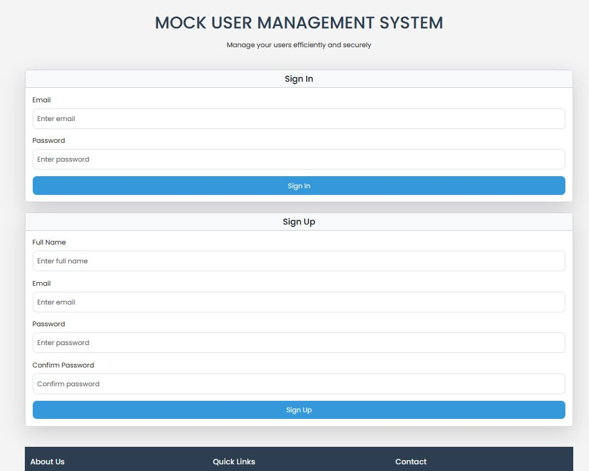
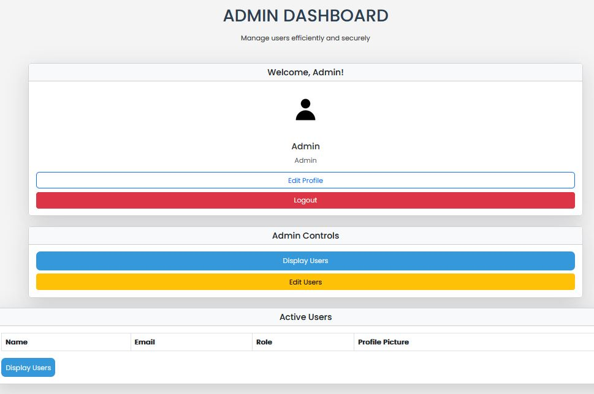

# Full-Stack-Mock-User-Management-System
## Web App simulating user account creation, editing, and management with dynamic storage for a workplace.

This full-stack web application simulates the actions of a user management system in the workplace. You can create an account, edit an exisiting account, and manage your account. There are two types of users in this app, user or admin. Depending on the role of the user, their priveleges vary. The user information and data is securely and dynamically stored, simulating that of a real world application.

This application was written with HTML, CSS, and JavaScript for the front-end.
PHP for the back-end.
MySQL/MariaDB for the database storage.

## Features
- **User Account Management**: Users can create, update, and manage their accounts. This includes changing profile pictures.
- **Password Hashing**: Passwords are securely hashed before being stored in the database using a hasing algorithm.
- **Database Integration**: User data is dynamically stored in MySQL/MariaDB.
- **Responsive UI**: Built with HTML, CSS, Bootstrap for a modern, mobile-friendly interface.
- **Fetch API**: JavaScript Fetch API is used to interact with the backend and retrieve data asynchronously.

## Technologies Used
- **Frontend**:  
  - HTML  
  - Bootstrap Styles  
  - Custom CSS Styles  
  - JavaScript  
  - Fetch API

- **Backend**:  
  - PHP (Server-side scripting)  
  - MySQL/MariaDB (Database)

- **Security**:  
  - Password Hashing (using PHP's `password_hash`)

## Preview:

